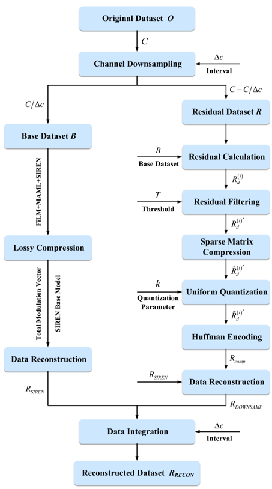

# MFSR-CD
Official PyTorch implementation of the paper "Meta-Optimized Implicit Neural Representation with Channel Downsampling for DAS Data Compression (MFSR-CD)".

# Introduction
Distributed Acoustic Sensing (DAS) has revolutionized long-distance monitoring in fields such as oil and gas pipeline security and microseismic detection. However, the technology's high sampling rates and spatial resolution generate massive volumes of data, creating severe bottlenecks for transmission and storage. Traditional compression methods (e.g., DWT, DCT) often struggle to balance compression ratios with signal fidelity, while emerging Implicit Neural Representations (INRs) typically suffer from prohibitive training times, requiring distinct optimization for each data segment.To address these limitations, this repository presents MFSR-CD (Meta-Optimized FiLM-SIREN with Channel Downsampling), a novel hybrid compression framework designed specifically for large-scale DAS data.

<p align="center">
  
</p>

# Environment
- numpy==1.21.0
- matplotlib==3.3.4
- torch==1.8.1
- ptflops==0.6.7
- scikit-learn==0.24.2
- torchvision==0.9.1
- thop==0.0.31
- torchstat==0.0.7
- seaborn==0.11.1
- pandas==1.2.5
- scipy==1.6.2
- tqdm==4.61.2
- wandb==0.18.7
- PyYAML

# Dataset
We provide the preprocessed DAS dataset used in this study. Due to the file size limitations of GitHub, the data is available in [Google Drive](https://drive.google.com/drive/folders/1srdK02utYxMTQ1MMucNEF2R32Gx1TVvW?usp=drive_link).

# Main
Please execute main.py for model training and validation, using the command:
> **Important:** Before running the command, please ensure that the **environment is correctly configured** (refer to the Environment section) and the **correct DAS data path** is specified in the configuration file (or script).

```bash
python main.py
```

> **Note:** Some functions have not been uploaded yet, and the complete code will be available soon.

# Contact
If any link is invalid or any question, please email zengsk@my.swjtu.edu.cn
